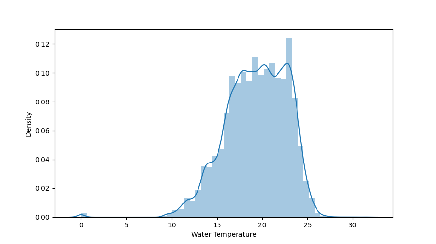

####################################
Correctness
####################################

*********
Description
*********

The data should match the conditions in reality as closely as possible. Measurement data should have as low an error value as possible. 

Detecting anomalies in a dataset can be critical for some businesses if hasty conclusions are drawn or hasty decisions are made.
To rid data sets of such anomalies, these outliers must be identified. Outliers are values that are irrationally far from their expected value.
The danger of outliers is that they influence average values and the standard deviation. 

Outliers can be values of just one variable or combination of at least two variables that can be considered as outliers.

********************
Tools and Libraries
********************

Python
=========

Python provides several methods to easily identifying outliers and statistical anomalies.

Find outliers in a given dataframe 
----------------------------------

The following data set contains sensor data from measuring stations at various beaches. 
For example, water temperature, wave size and wave period were recorded.

.. note::

   Code Snipped comming soon.

Visualize outliers
------------------

.. note::

   Code Snipped comming soon.

MATLAB
=========

C++
=========

********************
Literature
********************